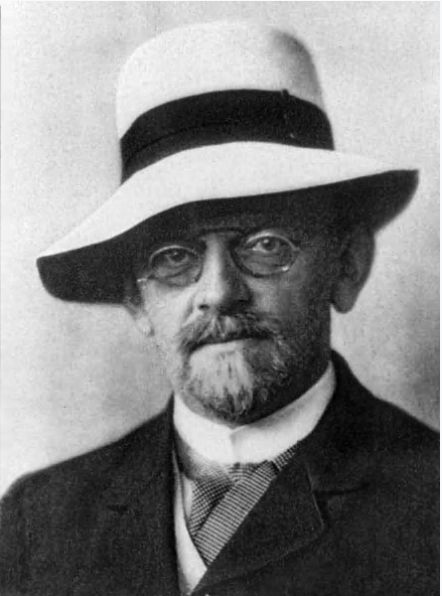
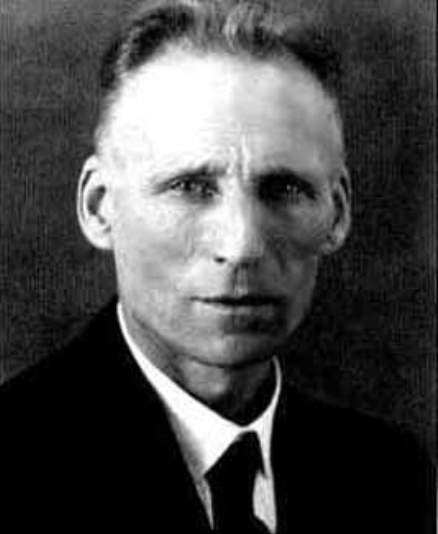

### Introduction
Mathematics is a language that formalizes human reasoning. It evolved out of necessity from observing physical phenomena and patterns that needed some form of formal structure to describe. Within mathematics, it is possible to be **certain** about things, and even in systems that might appear random, we are still able to create formalizations that capture patterns within randomness - a "certainty" about "randomness". 

Thus, one might describe mathematics as an expressive and powerful language that captures phenomena about many of the things that we can observe. However, modern mathematics has become more and more abstract -- many of the concepts that underly modern algebra or topology or analysis have little foundations and connections to the physical world, but instead serve as tools for dissecting and categorizing patterns that arise from such an expressive syntax. A common question asks, "Is mathematics discovered or created?" We can perhaps rephrase this question under the previous ideas as, "Should mathematics appeal to interpretability within observable phenomena or exist independent of it?"

This line of discussion brings me to one of my favorite ideas in mathematical philosophy: a "movement" known as intuitionism. 

### David Hilbert and Formalism

{:style="float: left; margin-right: 10px; width: 200px;"}
David Hilbert was one of the most influential mathematicians during the 1900s. One of his many celebrated achievements is his proposal of 23 important open problems which helped lay the foundations for mathematical research. His influence still has countless effects on today's philosophy of mathematics and the art of mathematical proof. 

However, perhaps his most important achievement was recognizing the poor state / lack of a foundation of mathematics (i.e., axioms) and the inconsistencies that arose when trying to properly define them. Hilbert wanted all mathematics to be rigorously defined and to that end, proposed the problem of finding a set of complete and consistent set of axioms. Today, this is known as Hilbert's Program, and was proven to be unprovable / unfindable by Kurt Gödel, who showed that formal systems cannot prove its own consistency and that there exists mathematics outside of provable mathematics in an axiomatic system (Incompleteness). 

Hilbert was also an influential proponent of mathematical formalism, which approached mathematics as a syntax / tool for simply manipulating symbols according to rules. To a formalist, mathematics could be seen as lacking inherent meaning. In other words, mathematics shouldn't be tied to our intuition, since it is independent of it. 

As a consequence, this implies that under a formalist perspective of mathematics, all proofs of some statement **S**, regardless of how it was proven, is acceptable as long as it follows the rules of the syntax. Hence, non-constructive proofs, which proves a statement **S** without giving an example of some object that satisfies **S** is also acceptable. 

In my opinion, this separates mathematics in syntax and interpretation. Mathematical formalizations need only be powerful enough to prove the truth or falsehood about statements -- any added interpretability exists outside of the syntax for our enjoyment and/or usefulness.

In any case, as formalist ideas grew during this time of increasing mathematical rigorization and transform, several ideas emerged and along with them, mathematicians / philosophers who had many things to say about the nature of mathematics / mathematical proof. 

### LEJ Brouwer and Intuitionism
{:style="float: left; margin-right: 10px; width: 200px;"}
Luitzen Egbertus Jan Brouwer was a mathematician who made sweeping contributions to topology. Later in his career, in contrast to the rise of mathematical formalist philosophy, he helped develop key ideas in a philosophy now called "Intuitionism". 

While ideas of what Brouwer believed should be "intuitionist" is not rigorously defined, it is generally interpreted that the intuitionist treats mathematics as the creation of the human mind and intuition, and hence, proofs corresponding to a mathematical syntax / logical syntax should appeal to this intuition. 

As a consequence, this implies that under an intuitionist perspective of mathematics, proofs of some statement **S** should be constructive. In other words, not only do proofs have to follow the rules of the syntax, but proofs aren't acceptable if they don't construct objects that satisfy the statement **S**. 

By why are nonconstructive proofs necessarily at odds with intuitionism? Suppose we claim, through human reasoning and intuition, that some mathematical object should exist. This claim is a very strong supposition on the nature of existence.
Specifically, if an object exists, then one should be able to **construct** the object that satisfies its properties. Non-constructive proofs are thus less powerful in an intuitionist perspective since existence is shown through the construction of the object, not through showing that it can't **not** be constructed. 

### Conclusion
The foundations of intuitionism poses a rebuttal to the formalist movement. From the humble beginnings of mathematics as a language for formalizing certainty to modern mathematics, which exists in some perhaps ill-defined distinction between usefulness and abstract realizations. Regardless, intuitionism or more generally, constructive logic, proposes that the usefulness of the existence of an object depends its ability to be constructed. If an object can be constructed, then it is a strong statement of its existence. 

Whichever side you lie on, these ideas help to probe the large question of the nature of mathematics: "Is mathematics discovered or created?", "What is the role of humans in mathematics?", "What does the future of mathematics look like?"

A future post will try to look into these questions as we slowly move into an era of smarter artificial intelligence. 