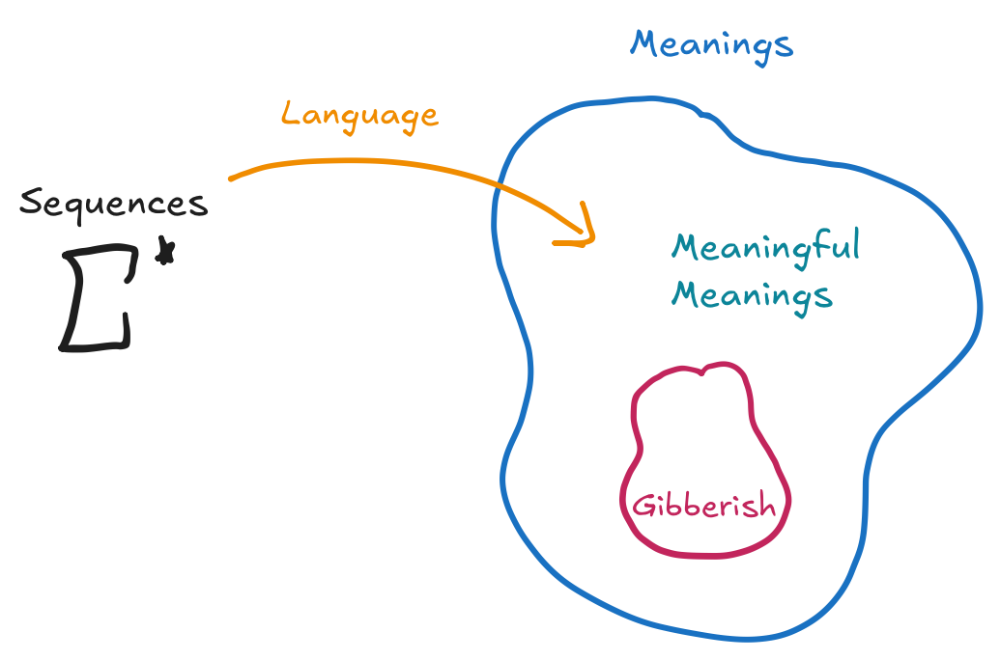

# Introduction
Back when I was applying for college, I wrote one of my application essays on how playing
piano, and music in general, was a medium of communication. It's slightly funny looking back
now, how much more time I have had to develop a deeper understanding of language as a concept,
and this post is dedicated to some of the things that I love about language(s).

# Some Definitions
Language, interestingly enough, can be mathematically formalized.
During this endeavor, one might define a set of characters that a language can be constructed from.
For us English speakers, this would be the Latin alphabet plus some extraneous characters for punctuation,
and other miscellaneous things, but for simplicity we'll ignore those for now.

Words are just sequences of characters, and we note that not all sequences of characters map to a word.
We call these sequences of characters "gibberish". 

>Example: asjdapisdoiatoiahso

We haven't defined yet what a word is, so we shall do that now: a word is a sequence of characters
for which there exists a mapping to the set of "meanings" minus the set of "gibberish"[^1].

[^1]: Although I use the word "meanings" here, it becomes easier to reason about this set by including the set, "gibberish" as a subset of "meanings", even if sequences of words in "gibberish" do not have "meanings". This is because even though gibberish is mostly seen as the choice of characters being unrecognizable by some language, it still has a "meaning" in this space of "meanings". For instance, the fact that you could recognize *asjdapisdoiatoiahso* as gibberish implies that there is some mapping in our language for unrecognizable sequences of characters. In more cs-y language, you can even think of this as a sink.

For those that took automata theory or some CS theory course, this is beginning to look really similar
to the Kleene Star formalization, and it should! Indeed, words for us are just elements of the Kleene Star
of a chosen alphabet with a bit more structure: they shouldn't be elements of "gibberish". 

Of course, I still haven't really defined "word" since it relies on this new definition of "meanings".
However, I won't define "meanings" and rather, insist that you come up with what this very abstract
set of "meanings" should look like. In *my* head, I think of this set of "meanings" as essentially,
every concept that can ever be defined. 

Finally, we can formally define what we mean by a "language" and this is where we begin to deviate
from the automata theory definition. To us, a "language" is simply a function which maps
elements of the Kleene Star to "meanings" minus "gibberish".

  

So to recap, we have the following definitions:

1. **Alphabet**: a set of characters. We call this set $$\Sigma$$ from here on.
2. **Sequences**: the kleene star, or just all finite sequences constructed from $$\Sigma$$. We'll call this set $$\Sigma^{*}$$ from here on.
2. **Meanings**: some abstract set of "concepts" or "things" or "objects". We call this set $$M$$ from here on.
3. **Language**: a function mapping sequences of characters to an element in "meanings". We call this function $$\mathcal{L}$$ from here on.
4. **Gibberish**: the complement of the image of $$\mathcal{L}$$ [^2]. We call this set $$G$$ from here on.
5. **Meaningful Meanings**: we call this set $$W$$, and define it as $$M \setminus G$$.
6. **Words**: the pre-image of $$W$$[^3].

[^2]: Intuitively, you can think of this as all meaning in meanings which doesn't have an appropriate

[^3]: Some skeptics of this definition might wonder how *asjdapisdoiatoiahso* could have a mapping by $$\mathcal{L}$$ to "gibberish" but we should be careful here. Indeed, *asjdapisdoiatoiahso* is gibberish but the actual sequence of characters "gibberish" is perfectly well defined. 

# On Language
With some semantics out of the way[^4], we can start looking at properties of $$\mathcal{L}$$ as well as something that I would like to call semantic completeness.
The most important point here is that $$\mathcal{L}$$ can be almost anything. Furthermore, if $$\mathcal{L}$$ was unique, the idea of multilinguality wouldn't make much sense since it
would imply that Korean is the same language as English, although this cannot be the case since they use different alphabets. Hence, perhaps a corollary to this point is that $$W$$ is almost consistent across different languages, at least on our planet. In other words, $$W$$ is unique and 